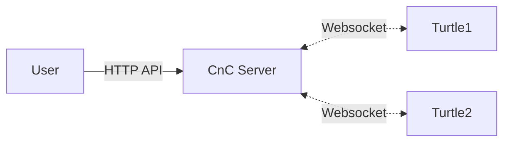

# cc-remote-control

* command and control for computer craft





## How to run it?
### Start the cnc server 
- ```go run main.go``` 
- you can run the server localy and use ngrok to expose it.
- ```ngrok http 4000```


### Turtle code:
* inside the turtle run:
```
  wget https://github.com/YakirOren/cc-remote-control/blob/a996c9d80fecafb073520177297fd9ac7c736ecb/client/client.lua
```
* Replace server url in the code to the url of your server. 

### Interface with the server using the python wrapper:
* the cnc server is running localy on port 4000.
```python
    from ccturtle import Turtle
    t = Turtle("http://localhost:4000", "c2d35786-e28a-4fff-bf82-a94c40f5fcff")

    t.forward()
    t.forward()
```

## Working example:


https://user-images.githubusercontent.com/39521848/197334729-4cd1ed50-70e8-4329-98e9-01e8fc2cfe12.mp4


